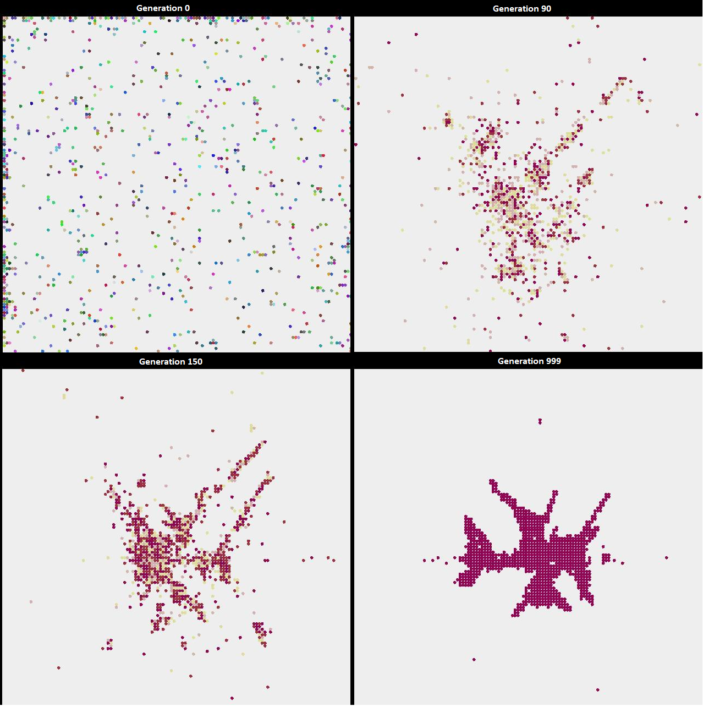
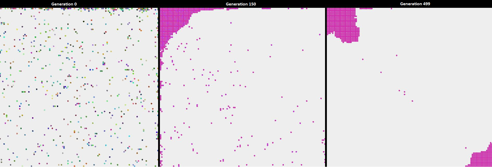
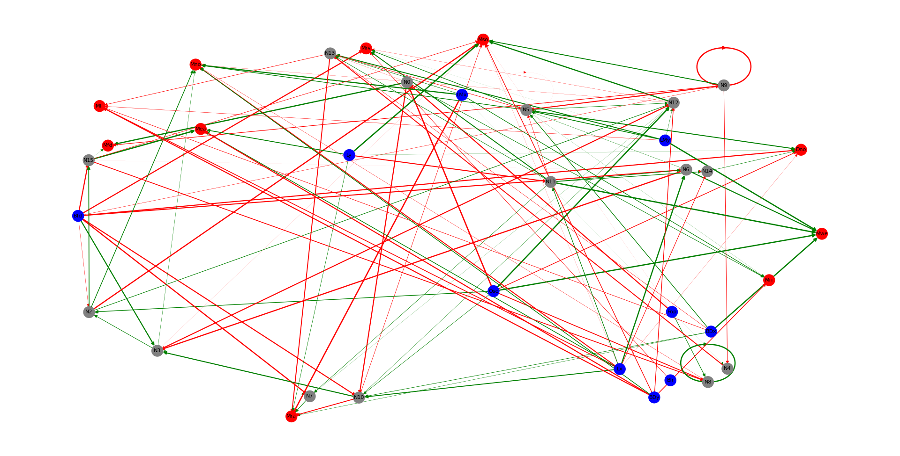

 
# An Evolution Simulation

Inspiration: https://github.com/davidrmiller/biosim4

This project is the product of 2 completely random events that happened at the same time. I needed some practice with
Java, and the YouTube algorithm found the absolutely brilliant video from David R. Miller named "I programmed some creatures. They
evolved." (https://www.youtube.com/watch?v=N3tRFayqVtk). 

This is not a 'serious' project. I wanted to retro-engineer David's creation just for fun and practice. There might be 
updates along the way, as long as it continues to amaze and entertain me!

# Code components

**Agent**

All beings in the simulation are instances of the class Agent. They can move in 4 directions in the world grid.
Instances of classes inheriting the Sensor interface collect data on the agent's current surroundings in the world grid.
An Action will be executed by an agent at each step of a generation. 
At the end of each generation, the remaining agents who survived the selection reproduce to fill the world quota for the
next generation.

**Neuron**

Basic implementation of a perceptron. There are 3 types of neurons, either sensory, action or hidden.

**Brain**

Multiple instances of the Neuron Class, organised in layers. First layer will always be all sensory neurons, and last 
layer all action neurons. Every connection between neurons is randomly generated at the agent's creation.
The function think defines the process where given its Sensors inputs, the brain outputs an Action. This action
corresponds to the highest activated action neuron in the brain (hard voting, no probabilities involved).

**Genome**

The genome is a combination of hexadecimal sequences. Each 24 bits sequence corresponds to an encoded connection of the
agent's brain. 8 bits are used to determine the initiator of the connection, 8 bits for the receiver, and 8 bits for the
weight of the connection. Genome diversity can be observed during the simulation with the agents colors. Similar colors
corresponds to closely similar genomes.

**Grid**

UI was really not the focus here. It is a very simple grid where each cell can be occupied only by one agent at a time.

**Selection criteria**

The selection criteria are the rules that determine which agents get to reproduce and those who do not. In this version
they are essentially "spatial", meaning that agents will survive and reproduce to the next generation only if they end 
up in specific zones of the grid. Three criteria are operational : right-side, center and corners of the grid.

**World**

Defines a single simulation run : grid dimensions, number of generations, number of steps per generation, the selection
criteria and the mutation rate.


# Run a simulation

No friendly UI for parametrisation, parameters are passed directly in the main script.

**Simulation 1**

Selection Criteria : right half side of the grid.
```
World world = new World(128, 128, 1000, 8, 1, 1, 500, 100, criteria, 0.001);
world.live();
```


**Simulation 2**

Selection Criteria : circle at the center of the grid.
```
World world = new World(128, 128, 1000, 128, 4, 4, 1000, 150, criteria, 0.01);
world.live();
```


**Simulation 3**

Selection Criteria : squares at the corners of the grid.
```
World world = new World(128, 128, 1000, 128, 4, 4, 500, 250, criteria, 0.01);
world.live();
```


# Simulation analysis

A bit of python code to visualise the most common brain type that resulted at the end of a simulation.

A simple brain example resulting from the simulation n°1.


A more complex brain example resulting from the simulation n°3.



# Next
