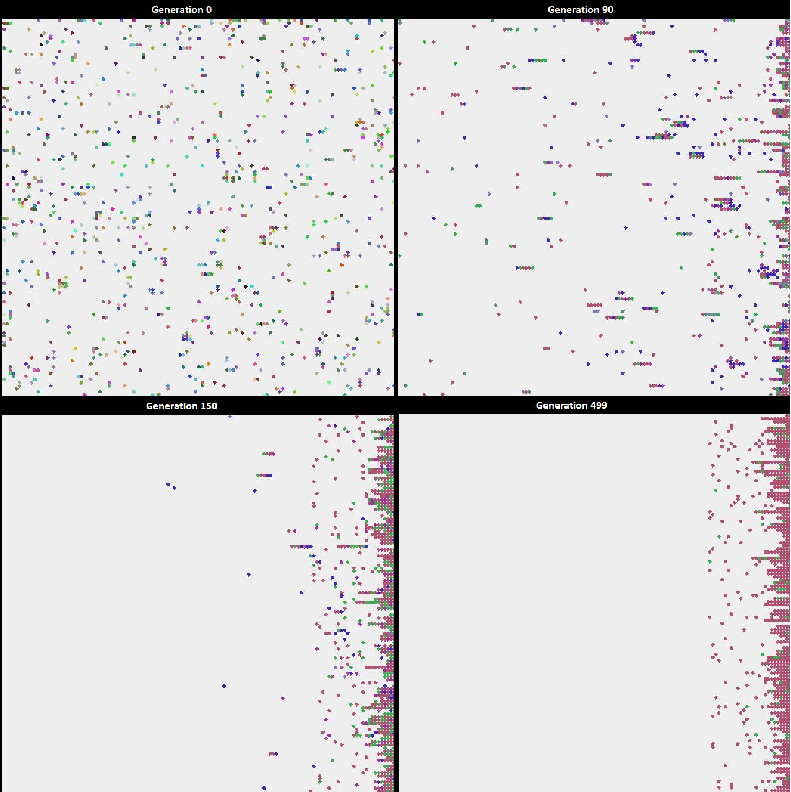
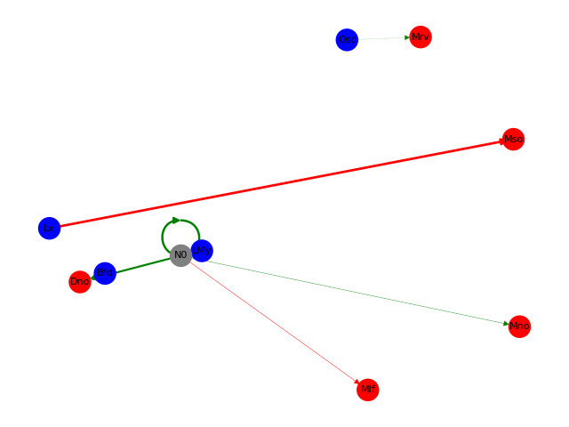

 
# An Evolution Simulation

Inspiration: https://github.com/davidrmiller/biosim4

This project is the product of 2 completely random events that happened at the same time. I needed some practice with
Java, and the YouTube algorithm found the absolutely brilliant video from David R. Miller named "I programmed some creatures. They
evolved." (https://www.youtube.com/watch?v=N3tRFayqVtk). 

This is not a 'serious' project. I wanted to retro-engineer David's creation just for fun and practice. There might be 
updates along the way, as long as it continues to amaze and entertain me!

# Code components

**Agent**

All beings in the simulation are instances of the class Agent. They can move in 4 directions in the world grid.
Instances of classes inheriting the Sensor interface collect data on the agent's current surroundings in the world grid.
An Action will be executed by an agent at each step of a generation. 
At the end of each generation, the remaining agents who survived the selection reproduce to fill the world quota for the
next generation.

**Neuron**

Basic implementation of a perceptron.

**Brain**

Multiple instances of the Neuron Class, organised in layers. There are 3 types of neurons, either sensory, action or 
hidden.
think -> output an Action (highest output, no probabilities)

**Genome**

Connections encoding
Diversity and colors

Grid
UI was really not the focus here

Selection criteria

World
Generations
Steps

# Run a simulation

No friendly UI for parametrisation.

**Simulation 1**

# Simulation analysis

# Next

# Execution logs
